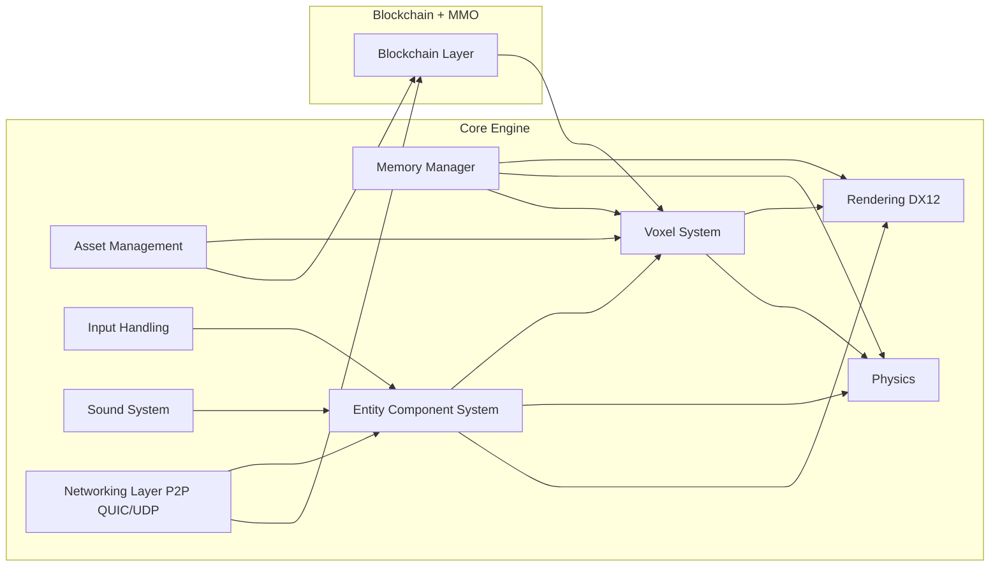
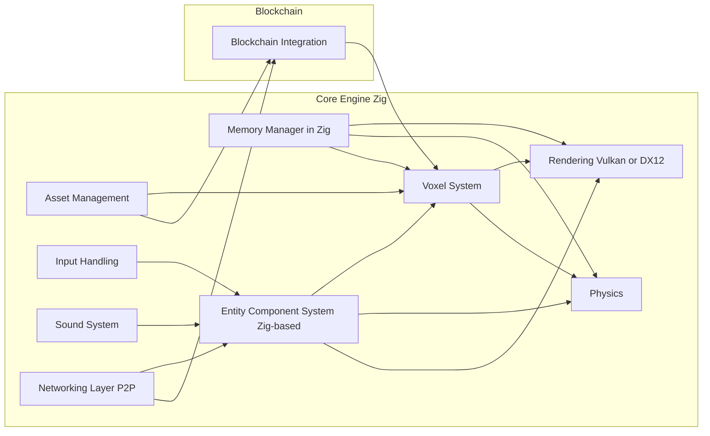

# Z3R0-ENGINE MMO: Overview and Architecture (Windows + NVIDIA)

This document provides an updated architectural overview for a **blockchain-backed MMO** that leverages **NVIDIA GPUs (CUDA)** for cryptographic operations and **DirectX 12** for high-fidelity rendering. The approach unapologetically targets **Windows + NVIDIA hardware only**, aligning with a “best hardware or bust” philosophy.

---

## 1. Key MMO + Blockchain Insights

1. **Peer-to-Peer MMO**:  
   - Each player runs a node replicating the blockchain for real-time game state updates (positions, actions, resource changes).

2. **Blockchain for Game State**:  
   - The blockchain ledger is used to store and validate major in-game events, handle asset ownership, and mitigate cheating.  
   - **Sharding** distributes world regions across nodes to prevent a single bottleneck.

3. **Ultra-Fast Consensus**:
   - **Delegated Proof-of-Stake (DPoS)** or **Proof-of-Authority (PoA)** for deterministic, low-latency block production (targeting sub-100ms block times).

4. **Full GPU Utilization**:
   - **CUDA** accelerates cryptographic hashing and block validation tasks in parallel to rendering tasks.  
   - **DirectX 12** is used for rendering, enabling next-gen features like ray tracing and advanced shading.

__
1. Core Engine: Consists of the rendering system, physics, voxel management, asset management, ECS, input, sound, and networking.
2. Blockchain Integration Layer: Manages communication between the blockchain network and the core engine.
3. Memory Manager: Provides custom allocators, pooling, and memory tracking.
---

3. Architectural Considerations
Windows + DirectX:
Target DirectX 12 exclusively.
No fallback for Linux or macOS.
GPU-Centric Approach:
Partition GPU resources for simultaneous rendering and consensus operations.
CUDA Streams to handle cryptography and hashing in parallel with frame rendering.
ECS for Gameplay:
Maintain a server-authoritative ECS but distributed across the blockchain.
Each node runs the same ECS logic; validated blocks finalize changes.
4. State Management Model
Local-Optimistic State: The client (node) updates local ECS state instantly for responsiveness.
Consensus Finalization: The local state is “soft” until the block is produced and validated on-chain.
Sharded World: Different shards (zones) in the MMO have their own sub-blockchains or partitioned ledgers, each validated by nodes in proximity or delegated nodes.
5. Interfaces Overview
Blockchain <-> ECS:
Game actions (attacks, trades, moves) become transactions.
Finalized blocks update ECS across all nodes.
Rendering <-> Voxel System:
Voxel chunks feed GPU buffers for DirectX 12 rendering.
Networking <-> Blockchain:
P2P connections broadcast block proposals, transactions, and node discovery events.
GPU Partitioning:
A multi-queue or multi-stream system ensures cryptographic tasks (hashing, signature verification) do not starve rendering threads.

____
Balanced Approach
# Z3R0-ENGINE MMO: Overview & Architecture (Zig + Vulkan or DirectX 12)

## 1. Introduction

This document outlines a **voxel-based MMO** engine architecture with a **blockchain** for state management. The majority of the codebase is intended to be written in **Zig**, leveraging its excellent memory safety, performance, and C interoperability. The engine can use either:

- **Vulkan** for graphics + compute
- **DirectX 12** for graphics, possibly with other compute frameworks
- **Optional Argument**: Why CUDA could still be preferable for some (see Section 4)

**Note**: If cross-platform compatibility is desired, **Vulkan** is recommended. If you target Windows primarily and want deep system integration, **DirectX 12** could be favored.

---

## 2. High-Level Architecture Diagram

1. Core in Zig: Memory, ECS, Voxel, Physics, etc., all written in Zig for performance and maintainability.
2. Rendering: Either Vulkan or DX12. Both are accessible from Zig via C bindings.
3. Blockchain: Optionally accelerate consensus tasks with Vulkan Compute or another compute approach.

3. Decentralized MMO Focus
    1. Peer-to-Peer Architecture:
        - Players are nodes in the network, replicating the blockchain for real-time state updates.
    2. Blockchain for Game State:
        - On-chain ownership, event logging, and anti-cheat.
    3. Voxel World:
        - Chunks or shards managed by the ECS, with critical changes anchored on-chain.
4. Vulkan vs. DirectX 12 for Rendering
    1. Vulkan Pros
        - Cross-Platform: Works on Windows, Linux, and more.
        - Modern API: Lower-level control, often parallels the features of DX12.
        - Compute Support: Vulkan Compute pipelines allow GPU acceleration for tasks like cryptography.
    2. Vulkan Cons
        - Complexity: Steep learning curve.
        - Platform Variances: GPU driver differences across OS.
    3. DirectX 12 Pros
        - Windows Optimization: Deep integration with Windows; less driver variance on Windows.
        - Well-Supported Debug Tools: PIX, Visual Studio integration.
        - Cutting-Edge Features: Raytracing, mesh shaders, etc., often first available on DX12 for Windows.
    4. DirectX 12 Cons
        - Windows-Only: Zero cross-platform support.
        - API Complexity: Similar low-level complexity as Vulkan.
5. Vulkan Compute vs. CUDA (For Blockchain)
    1. Vulkan Compute Pros
        - Cross-Platform: Works on AMD, NVIDIA, Intel GPUs.
        - Unified Rendering & Compute: Single API to manage all GPU tasks in your engine.
    2. Vulkan Compute Cons
        - Less Mature for GPGPU: Not as specialized as CUDA for certain HPC tasks (though rapidly improving).
        - Vendor Differences: Implementation details can vary more than with CUDA.
    3. CUDA Pros
        - Mature Ecosystem: Specialized HPC libraries, strong performance.
        - Optimized for NVIDIA: Usually outperforms Vulkan compute for certain complex tasks on NVIDIA hardware.
    4. CUDA Cons
        - Vendor Lock-In: Only works on NVIDIA GPUs.
        - Less Portable: No cross-platform to AMD or Intel GPUs.
6. Zig Interoperability
    - Vulkan: Exposed as a C API (vulkan.h), easily callable from Zig using @cImport.
    - DirectX 12: C++-based COM API. Can still be interfaced with from Zig by bridging COM definitions in C or a specialized Zig library.
    - CUDA: Also accessible via C bindings, but heavier bridging for some advanced features.
7. Conclusion
    - Whether you choose Vulkan or DirectX 12, Zig can provide a performant, memory-safe foundation for both your rendering and blockchain logic. If you desire cross-platform compatibility and want to unify rendering/compute, Vulkan is a natural choice. If you are targeting Windows-only and want top-tier integration, DirectX 12 can be optimal. If you still prefer NVIDIA-specific HPC solutions, CUDA remains a strong option for blockchain compute, albeit sacrificing GPU vendor-agnostic compatibility.